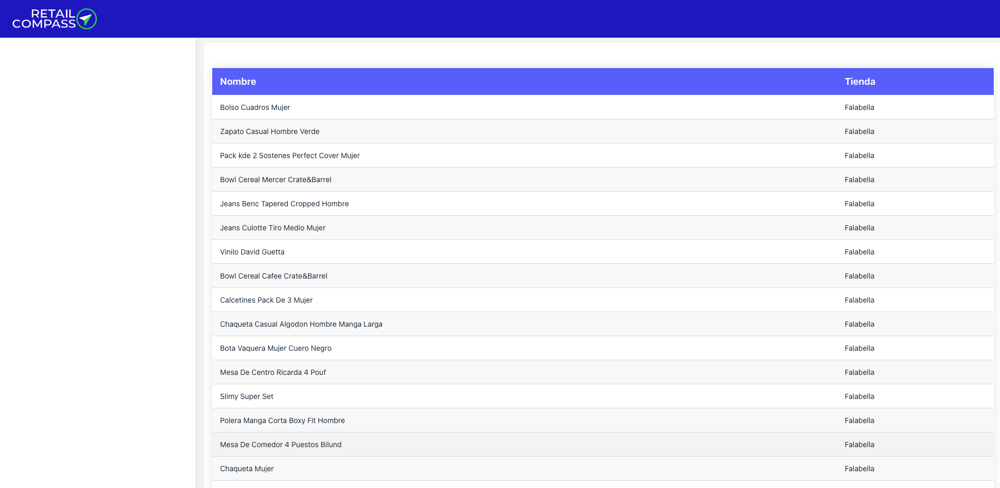
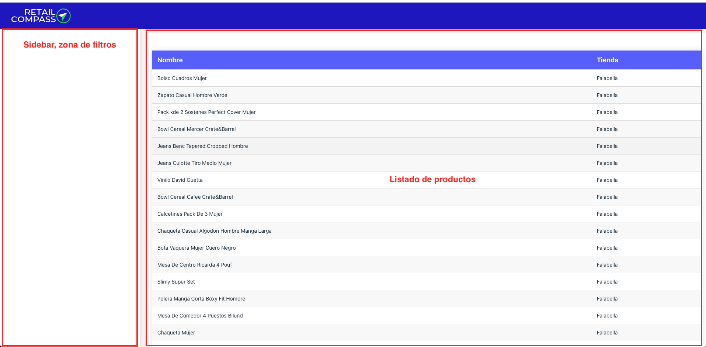

# Proyecto para evaluaciones

Este es un proyecto utilizado para las evaluaciones de los postulantes de RC.

## Prerrequisitos

- Node.js (version 14 or higher)
- npm (comes with Node.js)

## Instalación
1. Clonar el repositorio
2. Instalar dependencias: `npm install`
3. Configurar variables de entorno en `.env` en base al ejemplo `.env.example`
4. Iniciar el servidor: `npm run dev`
5. El servidor inicializa en `http://localhost:8080`

## Caso practico

### Descripción
Aplicación de evaluación de productos para RetailCompass.

### Características
- Listado de productos con paginación
- Visualización de un listado de productos
- Sidebar en blanco para filtros
- Conexión a API de RetailCompass

### Imágenes del Proyecto

#### Vista Principal

#### Exoplicacion del area de trabajo

### Reto para la postulacion
1. Para empezar a trabajar en el proyecto, primero crea un fork del repositorio en tu cuenta de GitHub." 
2. Incluir dentro del listado de productos los precios `(lowest, offer, normal)` y `descuento`. 
   El campo descuento se calcula en base a la siguiente formula `((normal - lowest)/normal) * 100`
3. Actualmente la integracion al API esta en metodo GET, cambiarlo para que soporte POST.
4. En el sidebar agregar filtro de `SKU` y `Status`, esto deberá alterar el listado de productos.
5. Evianos el PR para evaluarte.

### Documentacion del API
1. APIKey para la evaluacion: `ff236fbd608a479b8d2025a3791bb848`
2. Documentación: `https://docs.google.com/document/d/1tfdvlFrvE6RGFd_r6dblwDTOIRK520Wku8kLWTpb6TA/edit?usp=sharing`

